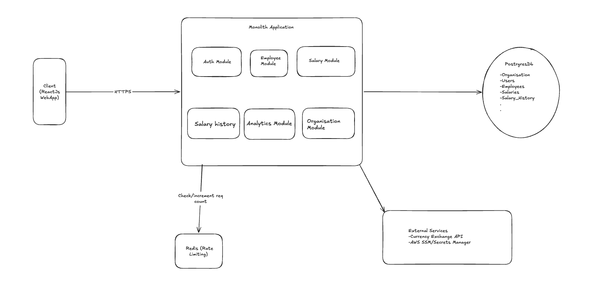

# Salary Management System

Salary Management System is an MVP web application for HR teams to manage employee compensation, salary revisions, and compensation analytics in one place. It supports authenticated HR users, organization-scoped employee records, salary updates, salary history, and dashboard insights.

## Overview

The product is designed for internal HR compensation workflows:

- HR managers can log in securely.
- Employee data can be viewed, searched, filtered, and created.
- Current salary details and salary history are tracked per employee.
- Salary updates preserve historical records instead of overwriting audit data.
- Analytics summarize workforce salary distribution, payroll, departments, countries, roles, and levels.

## Tech Stack

- **Frontend:** React, TypeScript, Vite, MUI, React Router, Axios
- **Backend:** Node.js, TypeScript, Fastify, Zod
- **Database:** PostgreSQL with Prisma ORM
- **Cache / Rate Limiting:** Redis
- **Authentication:** JWT
- **Testing:** Vitest, React Testing Library
- **Deployment:** Docker, Docker Compose, Nginx, systemd, EC2

## Features

- JWT-based login for HR users
- Protected frontend routes
- Dynamic logged-in user and organization display
- Employee list with filtering, searching, pagination, and create employee modal
- Employee profile with tabbed salary details and salary history
- Salary update workflow with reason and effective date
- Salary history audit records
- Dashboard analytics and polished compensation charts
- Local currency display helper for salary views
- Request logging and health checks
- Redis-backed token bucket API rate limiting
- EC2-oriented Docker deployment configuration

## Architecture

The application follows a **modular monolith** architecture. The backend is deployed as one API service while keeping modules separated by business capability.

Backend modules include:

- Authentication
- Employees
- Salaries
- Salary History
- Analytics
- Health Checks

PostgreSQL stores persistent business data. Redis stores temporary token bucket state for API rate limiting. The React frontend communicates with the API over REST.



More detail:

- [Architecture](./docs/architecture.md)
- [Technical Trade-offs](./docs/tradeoffs.md)
- [Rate Limiting](./docs/rate-limiting.md)

## Local Setup

### Prerequisites

- Node.js 20+
- npm
- Docker and Docker Compose

### Install Dependencies

```bash
npm install
```

### Environment Variables

Copy the example environment file:

```bash
cp .env.example .env
```

Important variables:

- `DATABASE_URL`: PostgreSQL connection string
- `REDIS_URL`: Redis connection string
- `JWT_SECRET`: JWT signing secret
- `CORS_ORIGIN`: allowed frontend origin
- `VITE_API_BASE_URL`: frontend API base URL
- `RATE_LIMIT_ENABLED`: enables API rate limiting
- `RATE_LIMIT_BUCKET_CAPACITY`: global token bucket capacity
- `RATE_LIMIT_REFILL_TOKENS`: tokens restored per interval
- `RATE_LIMIT_REFILL_INTERVAL_MS`: token refill interval

### Start Local Development

Start Postgres, Redis, and the API with Docker:

```bash
docker compose up --build
```

The API will be available at:

```text
http://localhost:3000/v1/health
```

Start the frontend separately:

```bash
npm run dev -w @salary-management/web
```

The web app will be available at:

```text
http://localhost:5173
```

For local API-only development without Docker, run:

```bash
npm run dev -w @salary-management/api
```

## Seed Data

Seed data creates the default ACME organization, HR manager, employees, salaries, and salary history records.

For local development:

```bash
npm run prisma:seed -w @salary-management/api
```

For the Docker API container:

```bash
docker compose exec api node dist/prisma/seed.js
```

To verify seeded employees:

```bash
docker compose exec postgres sh -lc 'psql -U "$POSTGRES_USER" -d "$POSTGRES_DB" -c "select count(*) from employees;"'
```

## Demo Credentials

Seeded login user:

```text
Email: hr.manager@acme.example
Password: Password123!
```

## Demo Flow

Use this flow to review the MVP end to end:

1. Log in with the seeded HR manager credentials.
2. Review the dashboard summary cards for employee count, payroll, average salary, and median salary.
3. Open the analytics dashboard and review compensation charts by country, department, role, level, and salary bands.
4. Navigate to Employees.
5. Search for an employee by name, email, or employee code.
6. Apply filters such as country, department, role, level, or status.
7. Open an employee profile from the employee list.
8. Review the employee detail tab for profile and current salary information.
9. Open the salary update form, enter a new salary amount, reason, and effective date, then save.
10. Confirm the current salary details refresh after the update.
11. Switch to the Salary History tab and verify the salary change appears with previous amount, new amount, reason, effective date, and changed-by user.
12. Return to analytics and confirm compensation summaries still load after the update.

## Tests

Run all workspace tests:

```bash
npm run test
```

Run focused workspace tests:

```bash
npm run test -w @salary-management/api
npm run test -w @salary-management/web
```

Run type checks:

```bash
npm run typecheck
```

Run the focused API rate-limit suite:

```bash
cd apps/api
npx vitest run tests/integration/rate-limit/rate-limit.behavior.test.ts
```

## Deployment

The project includes an EC2 deployment guide using Docker Compose, externalized environment files, Redis, PostgreSQL, host Nginx, and systemd.

- [EC2 Deployment Guide](./docs/deployment-ec2.md)

Expected EC2 paths:

```text
/opt/salary-management-system
/etc/salary-management-system/api.env
/etc/salary-management-system/postgres.env
```

Start the EC2 stack from the repo root:

```bash
docker compose -f deploy/ec2/docker-compose.ec2.yml up -d --build
```

The EC2 stack runs separate containers for:

- PostgreSQL
- Redis
- API

The API binds to `127.0.0.1:3000` and should be exposed through Nginx.

## Assumptions

- The MVP is used by HR users inside one organization-scoped application flow.
- Salary amounts are stored in USD as the base reporting currency.
- Local currency conversion is display-only.
- The seeded ACME dataset is demo data, not production data.
- Redis is required in production when rate limiting is enabled.
- PostgreSQL is the source of truth for business data.
- Frontend display user details may be stored in cookies, but sensitive auth data should not be stored unnecessarily.

## Trade-offs

- The backend is a modular monolith to keep MVP deployment and debugging simple.
- JWT authentication uses a single token for now instead of access and refresh tokens.
- Redis-backed token bucket rate limiting adds an infrastructure dependency but supports multi-instance API deployments.
- Salary updates create history records for auditability, which increases storage usage.
- EC2 Docker Compose is simple for the MVP, while RDS, ElastiCache, ECS/Fargate, and CloudFront are better long-term production targets.

More detail:

- [Technical Trade-offs](./docs/tradeoffs.md)

## AI Usage Summary

AI assistance was used to accelerate implementation and documentation work, including:

- Reviewing and updating frontend UI flows
- Implementing salary detail and salary history API behavior
- Adding Redis-backed token bucket rate limiting
- Improving dashboard analytics layout
- Writing and updating tests
- Drafting deployment and rate-limit documentation

Human review remains required for production deployment, secrets management, infrastructure hardening, and final business acceptance.

## Status

Currently under development as an MVP.
